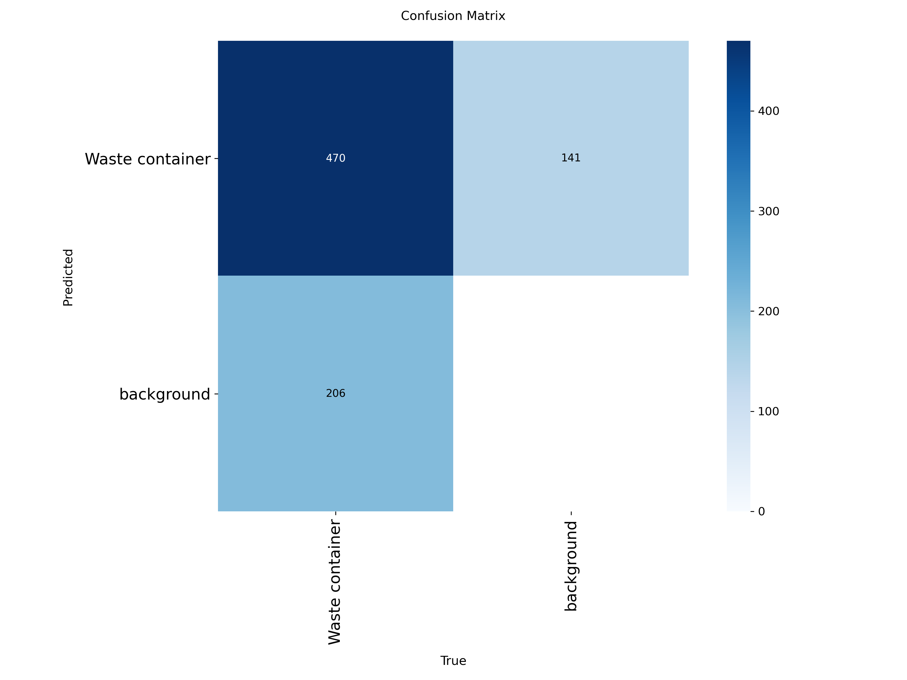
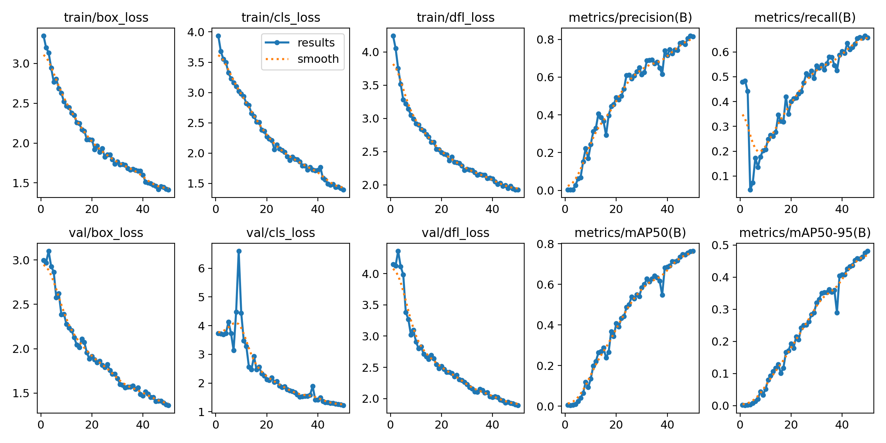

# Zero_waste_dataset

This project trains a custom YOLOv8 object detection model to identify **waste containers** in images and videos. The model is capable of distinguishing between "waste container" and "background" with reasonable accuracy and precision.

---

To access the Data go to -> https://drive.google.com/drive/folders/1TKFv9AoErWX-coykaXmsLgtewMRaopXt?usp=sharing
---

## 🧠 Model Summary

- **Architecture**: YOLOv8 (Ultralytics)
- **Classes**: `Waste container`, `Background`
- **Training Epochs**: 50
- **Framework**: Python, Ultralytics YOLOv8
- **Training/Inference Environment**: Google Colab

---
## 📊 Evaluation Results

### Confusion Matrix
- True Positives (TP): **470**
- False Positives (FP): **206**
- False Negatives (FN): **141**



### Training & Validation Metrics

| Metric            | Final Value |
|-------------------|-------------|
| Precision         | ~0.75       |
| Recall            | ~0.65       |
| mAP@0.5           | ~0.75       |
| mAP@0.5:0.95      | ~0.48       |



---

## 🎥 How to Run Inference on Video

1. **Upload video** to Colab or place your `.mp4`/`.avi` in the working directory.

2. **Load the model and run prediction**:
```python
from ultralytics import YOLO
model = YOLO('best.pt')

results = model.predict(
    source='your_video.mp4',
    save=True,
    conf=0.25
)
